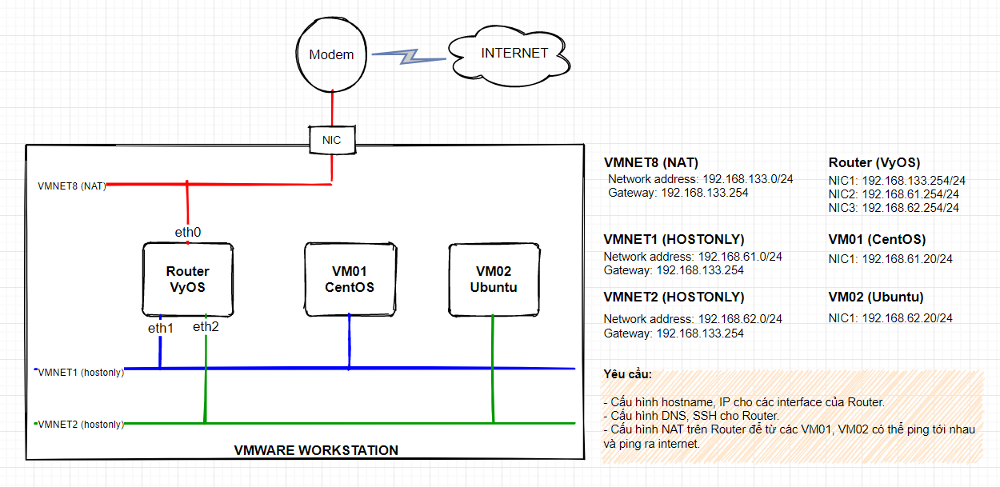
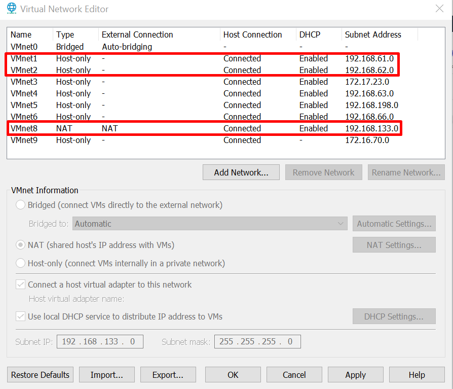
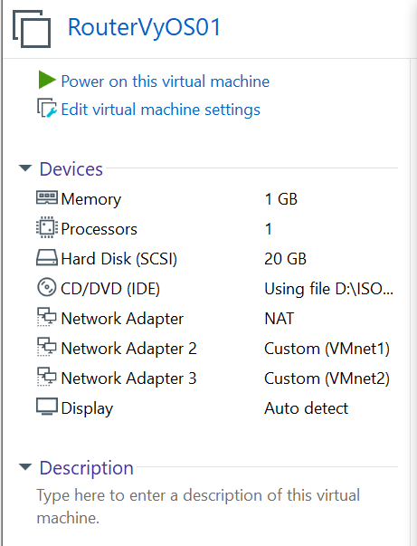
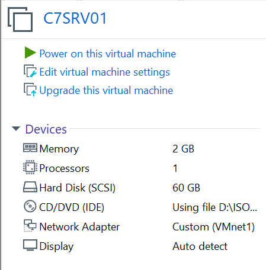

# Tài liệu dựng VyOS trong môi trường Vmware Workstation.

# Mô hình LAB

Mô hình LAB VyOS trên VMware Workstation.

# IP Planning

# Cài đặt 

## Thiết lập card mạng trên vmware và cấu hình setup cho vm.

### Cấu hình network cho vmware workstation.

{:height="50%" width="50%"}

### Cấu hình cho VM cài đặt VyOS

Thiết lập cấu hình dành cho máy ảo cài đặt VyOS như trong hình vẽ.

{:height="50%" width="50%"}

VM cài VyOS sử dụng bộ cài `vyos-rolling-latest.iso`, sử dụng 03 NIC, trong đó.
- NIC1 sử dụng card NAT - Đóng vai trò là WAN
- NIC2, NIC3 lần lượt sử dụng vmnet1 và vmnet2, đóng vai trò là các vlan.

Xem hướng dẫn cài đặt VyOS tại link [Cập nhật link vào đây]

### Cấu hình cho VM cài đặt CentOS

Thiết lập cấu hình cho VM cài CentOS 7 server 64 bit, đóng vai trò là client. VM này sử sụng vmnet1.

{:height="50%" width="50%"}

### Cấu hình cho VM cài đặt Ubuntu

Thiết lập cấu hình cho VM cài Ubuntu 18.04 server , đóng vai trò là client. VM này sử sụng vmnet2.

{:height="50%" width="50%"}

